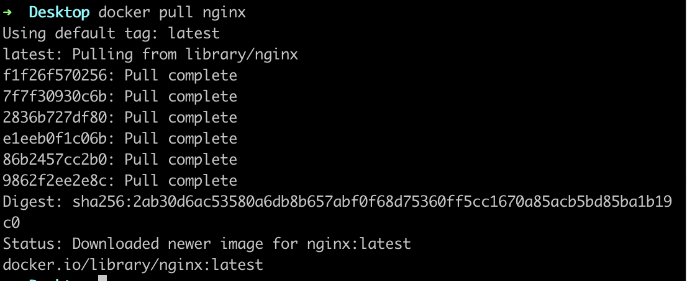
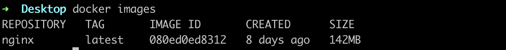
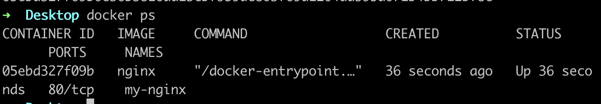
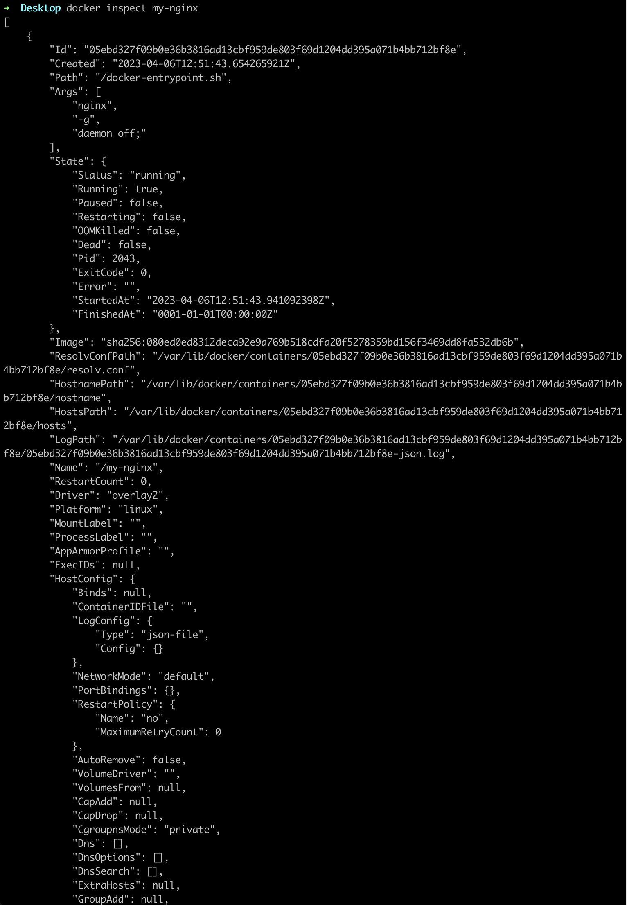
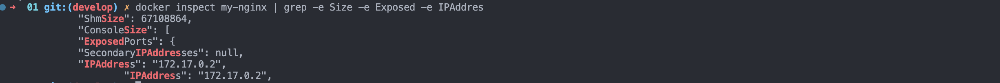
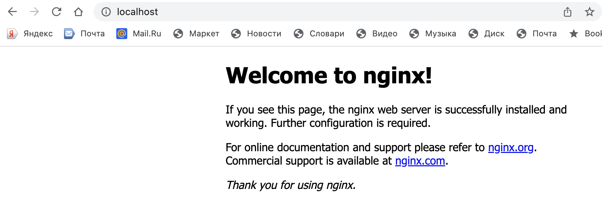

# Руководство по работе с Docker и контейнером Nginx

Добро пожаловать! В этом руководстве вы узнаете, как использовать Docker для работы с официальным образом Nginx, включая загрузку образа, запуск контейнера, проверку его состояния, а также настройку портов и перезапуск контейнера. Давайте начнем!

## Шаг 1: Загрузка Docker-образа Nginx

Для начала, загрузим официальный Docker-образ Nginx с помощью команды `docker pull`:

`docker pull nginx`  

  

## Шаг 2: Проверка образов Docker  

Затем вы можете проверить список доступных образов Docker на вашем локальном компьютере с помощью команды docker images:  
`docker images`  

  

##  Шаг 3: Запуск контейнера Nginx  

Теперь давайте запустим контейнер Nginx из загруженного образа с использованием команды docker run, и укажем пользовательское имя контейнера с помощью флага --name:  

`docker run -d --name my-nginx nginx`  

##  Шаг 4: Проверка статуса контейнера  

Чтобы проверить статус работающих контейнеров, вы можете использовать команду docker ps:  

  

##  Шаг 5: Просмотр информации о контейнере  

Если вам нужно просмотреть подробную информацию о конкретном контейнере, вы можете использовать команду docker inspect, указав ID или имя контейнера:  

`docker inspect my-nginx`  

  
  

##  Шаг 6: Остановка контейнера  

Чтобы остановить работающий контейнер, вы можете использовать команду docker stop, указав ID или имя контейнера:  

`docker stop my-nginx`  

  

## Шаг 7: Проверка статуса контейнера  

`docker ps`    
  

## Шаг 8: Запуск Docker-образа Nginx с настройкой портов  

Теперь давайте запустим контейнер Docker с портами 80 и 443, отображенными на те же порты на локальной машине с помощью команды docker run:  

`docker run -d --name my-nginx -p 80:80 -p 443:443 nginx`    
  

## Шаг 9: Проверка доступности страницы Nginx  

Теперь вы можете проверить доступность страницы Nginx в браузере, открыв localhost:80 в вашем веб-браузере.    
  

## Шаг 10: Перезапуск контейнера  

Если вам нужно перезапустить контейнер Nginx, вы можете использовать команду docker restart, указав ID или имя контейнера:  

`docker restart my-nginx`  
  

## Шаг 11: Проверка состояния контейнера  

тобы убедиться, что контейнер успешно перезапущен, вы можете проверить его состояние с помощью любого доступного метода, например командой docker ps или проверкой доступности страницы Nginx в браузере.