## Prerequisites  

Docker installed on your local machine

# Шаг 1: Прочитайте файл конфигурации nginx.conf в Docker-контейнере

Используйте команду docker exec, чтобы прочитать файл конфигурации nginx.conf внутри Docker-контейнера:

`docker exec my-nginx cat /etc/nginx/nginx.conf`  

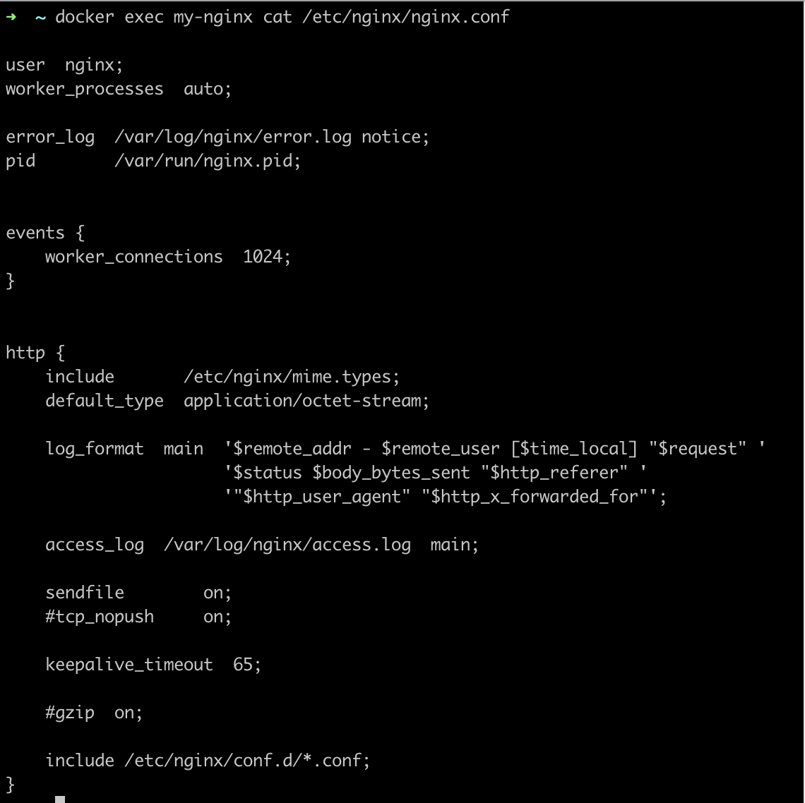  

## Шаг 2: Создайте файл nginx.conf на локальной машине

Создайте новый файл nginx.conf на вашей локальной машине с желаемой конфигурацией для пути /status, чтобы возвращать страницу статуса сервера nginx. Файл nginx.conf обычно содержит директивы конфигурации, которые определяют, как nginx должен обрабатывать входящие запросы, включая блоки сервера, блоки location и различные настройки, такие как проксирование, кэширование, SSL и т. д.

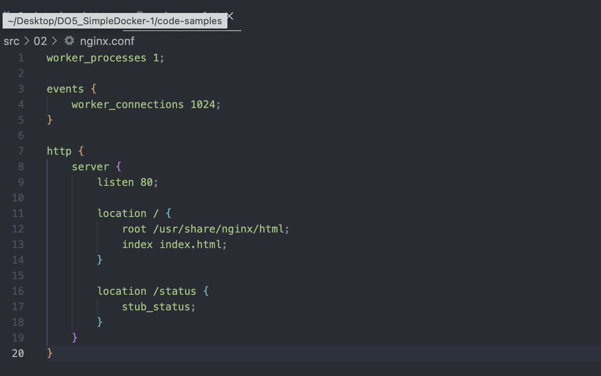  

##  Шаг 3: Копирование файла nginx.conf в Docker-образ  

Скопируйте созданный файл nginx.conf с вашей локальной машины в Docker-образ с помощью команды docker cp: 

`docker cp ./nginx.conf my-nginx:/etc/nginx/nginx.conf` (Удостоверьтесь, что вы запустили контейнер в этой директории, иначе нужно будет прописывать путь до конф файла)  

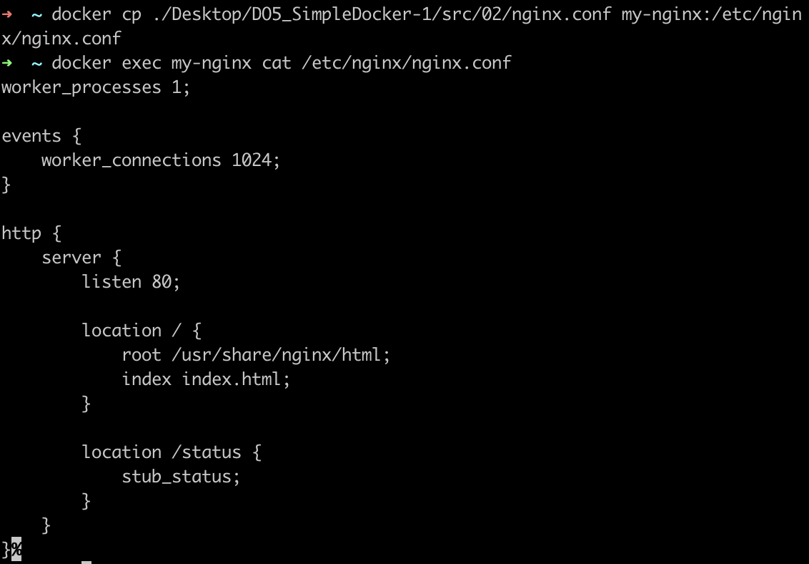

##  Шаг 4: Перезапустите nginx внутри Docker-образа  

Перезапустите nginx внутри Docker-образа, чтобы применить новую конфигурацию с помощью команды docker exec:  
`docker exec my-nginx nginx -s reload`  

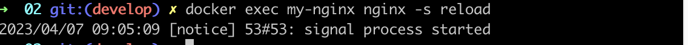  

##  Шаг 5: Проверьте страницу статуса сервера nginx  

Откройте localhost:8080/status в вашем веб-браузере, чтобы проверить, доступна ли теперь страница статуса сервера nginx.  

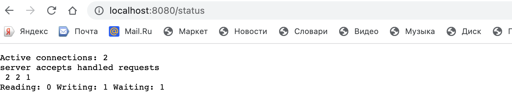  

##  Шаг 6: Экспорт контейнера в файл container.tar  

Экспортируйте Docker-контейнер в файл container.tar с помощью команды docker export:  

`docker export my-nginx > container.tar`  

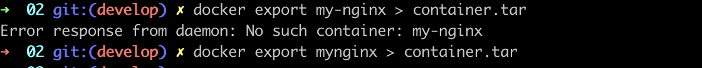  

## Шаг 7: Остановите контейнер  
Остановите Docker-контейнер с помощью команды docker stop:  

`docker stop mynginx`    
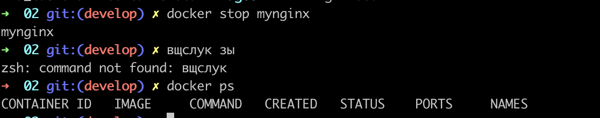  

## Шаг 8: Удалите Docker-образ  

Удалите Docker-образ без удаления контейнера сначала с помощью команды docker rmi:  

`docker rmi [image_id|repository]`  

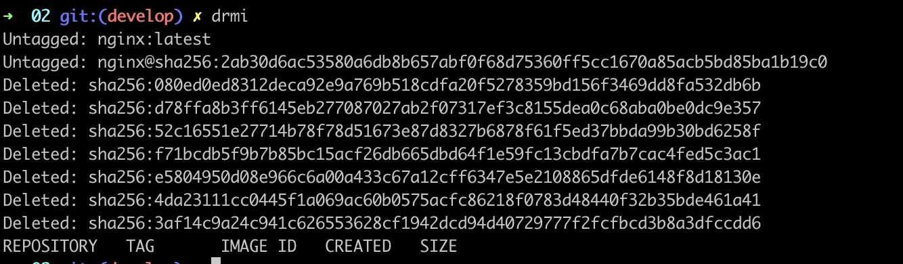  

## Шаг 9: Удалите остановленный контейнер  

Удалите остановленный Docker-контейнер с помощью команды docker rm:  
`docker rm my-nginx`  
\    
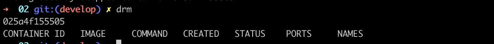  

## Шаг 10: Импортируйте контейнер из файла container.tar  

Импортируйте Docker-контейнер обратно из файла container.tar с помощью команды docker import:  

`docker import container.tar my-nginx`  

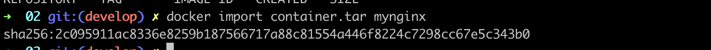  

## Шаг 11: Запустите импортированный контейнер с использованием команды docker run:  

`docker run -d -p 80:80 mynginx nginx`  

Эта команда запускает контейнер с использованием образа my-nginx, который был создан на предыдущем шаге при импорте контейнера из файла container.tar. Опция -d означает, что контейнер будет запущен в фоновом режиме, -p 80:80 указывает на проброс портов, где 80:80 означает, что порт 80 контейнера будет доступен на порту 80 хост-системы.  

    

## Шаг 12: Проверьте работу контейнера:  

После запуска контейнера вы можете проверить его работу, открыв веб-браузер и перейдя по адресу http://localhost/. Если контейнер с веб-сервером Nginx был успешно импортирован и запущен, то вы должны увидеть стандартную приветственную страницу Nginx в браузере.  
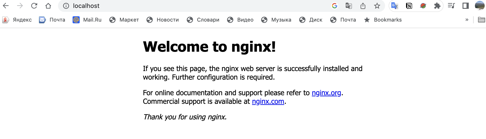    
