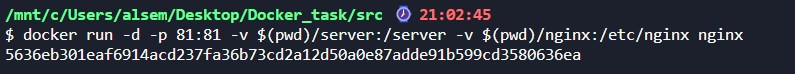
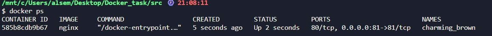
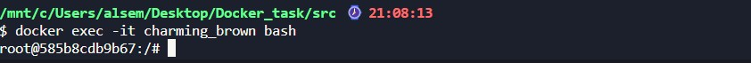
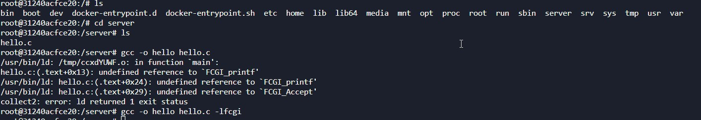
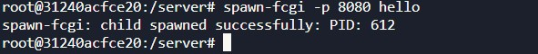
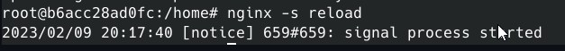
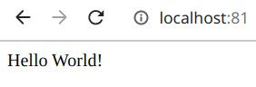

# Шаг 1: Запуск контейнера Docker с nginx  

```
docker run -d -p 81:81 -v $(pwd)/server:/server -v $(pwd)/nginx:/etc/nginx nginx
```

 В данном шаге выполняется команда для запуска контейнера Docker с использованием образа nginx. Опция `-d` указывает на фоновый режим работы контейнера, `-p 81:81` настраивает проброс портов, `-v $(pwd)/server:/server` и `-v $(pwd)/nginx:/etc/nginx` монтируют локальные директории `server` и `nginx` в соответствующие пути внутри контейнера. Это позволяет передавать файлы и настройки в контейнер. `nginx` в конце команды указывает на использование образа с именем "nginx".  

 

## Шаг 2: Проверка работающих контейнеров
***
```
docker ps
```

 В данном шаге выполняется команда для вывода информации о работающих контейнерах Docker. Это позволяет убедиться, что контейнер с nginx успешно запущен.  

 

## Шаг 3: Получение доступа к оболочке контейнера
***
```
docker exec -it <container_name> bash
```

 В данном шаге выполняется команда для получения доступа к оболочке (терминалу) контейнера Docker с именем `<container_name>`. Это позволяет выполнить команды внутри контейнера и взаимодействовать с его файловой системой.  

 

## Шаг 4: Установка зависимостей и компиляция сервера
***
```
apt update && apt install -y gcc spawn-fcgi libfcgi-dev
```

 В данном шаге выполняется команда для обновления пакетного менеджера и установки зависимостей, таких как `gcc`, `spawn-fcgi` и `libfcgi-dev`. Эти пакеты необходимы для компиляции и запуска сервера.

```
ls
```

 В данном шаге выполняется команда для вывода содержимого текущей директории. Это может быть полезно для проверки наличия нужных файлов и директорий.

```
cd server
```

 В данном шаге выполняется команда для перехода в директорию `server`. Это может быть необходимо для последующих операций с файлами и компиляции сервера.

```
gcc -o hello hello.c -lfcgi
```

 В данном шаге выполняется компиляция сервера из исходного кода `hello.c` с использованием компилятора `gcc` и опции `-o hello` указывает на имя выходного файла после компиляции, а опция `-lfcgi` указывает на использование библиотеки `libfcgi` при компиляции. Эта команда компилирует исходный код сервера и создает исполняемый файл `hello`.  

 

## Шаг 5: Запуск сервера с использованием spawn-fcgi  
***
```
spawn-fcgi -p 8080 hello
```
 В данном шаге выполняется команда для запуска сервера с использованием утилиты spawn-fcgi. Опция -p 8080 указывает на порт, на котором будет слушать сервер, и hello - имя исполняемого файла сервера, который был скомпилирован на предыдущем шаге. Эта команда запускает сервер на порту 8080.  

 


## Шаг 6: Перезагрузка конфигурации nginx  
***
```
nginx -s reload
```
 В данном шаге выполняется команда для перезагрузки конфигурации nginx. Это позволяет применить изменения в настройках nginx, такие как настройка проксирования запросов на сервер, который был запущен на предыдущих шагах.   

  

 ## Шаг 7: Проверка работы мини - сервера  
 ***
  Теперь вы запустили мини-сервер, используя spawn-fcgi, и настроили nginx на проксирование запросов к нему.

Теперь вы можете протестировать сервер, обратившись по URL "localhost:81" в веб-браузере, что должно вернуть страницу, которую вы написали.  


  
