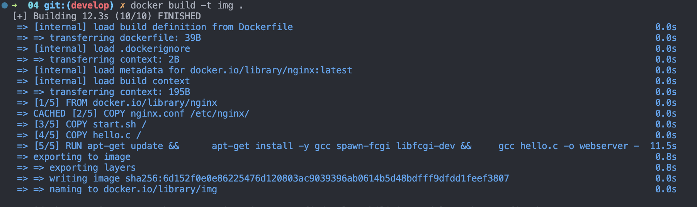
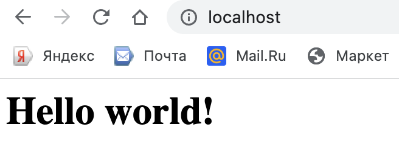
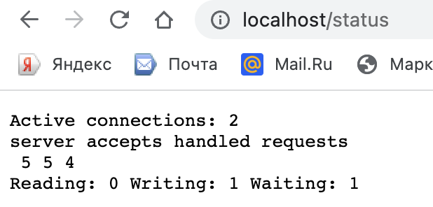

# 4. Мой докер  

Сначада следует создать ряд файлов.  
## 1. nginx.conf  
```
http {
    include       mime.types;
    default_type  application/octet-stream;


    sendfile        on;

    keepalive_timeout  65;

    server {
        listen       81;
        server_name  localhost;

        location / {
            fastcgi_pass 127.0.0.1:8080;
        }

        location = /status {
            stub_status;
        }
    }
}
```

  
  <table>
  <thead>
  <tr>
  <th>Строка</th>
  <th>Объяснение</th>
  <th>Полезные ссылки</th>
  </tr>
  </thead>
  <tbody>
  <tr>
  <td>`worker_processes 1;`</td>
<td>Определяет количество рабочих процессов, которые будут использоваться в сервере nginx. В данном случае будет использоваться только один рабочий процесс.</td>
<td><a href="http://nginx.org/en/docs/ngx_core_module.html#worker_processes" target="_new">Документация nginx по директиве worker_processes</a></td>
</tr>
<tr>
<td>`events { ... }`</td>
<td>Определяет блок конфигурации модуля events, который настраивает обработку событий, таких как соединения и запросы, в nginx.</td>
<td><a href="http://nginx.org/en/docs/ngx_core_module.html#events" target="_new">Документация nginx по модулю events</a></td>
</tr>
<tr>
<td>`worker_connections 1024;`</td>
<td>Устанавливает максимальное количество соединений, которые каждый рабочий процесс может обрабатывать одновременно. В данном случае, каждый рабочий процесс может обрабатывать до 1024 соединений.</td>
<td><a href="http://nginx.org/en/docs/ngx_core_module.html#worker_connections" target="_new">Документация nginx по директиве worker_connections</a></td>
</tr>
<tr>
<td>`http { ... }`</td>
<td>Определяет блок конфигурации модуля http, который настраивает обработку HTTP-запросов и ответов в nginx.</td>
<td><a href="http://nginx.org/en/docs/ngx_http_module.html" target="_new">Документация nginx по модулю http</a></td>
</tr>
<tr>
<td>`include mime.types;`</td>
<td>Включает файл mime.types, который содержит отображения расширений файлов на MIME-типы. Это позволяет nginx определить правильный MIME-тип для передачи файлов.</td>
<td><a href="http://nginx.org/en/docs/http/ngx_http_core_module.html#mime_types" target="_new">Документация nginx по директиве mime.types</a></td>
</tr>
<tr>
<td>`default_type application/octet-stream;`</td>
<td>Устанавливает MIME-тип по умолчанию, который будет использоваться, когда nginx передает файл с неизвестным MIME-типом. В данном случае, тип по умолчанию установлен на `application/octet-stream`, что является бинарным типом файла.</td>
<td><a href="http://nginx.org/en/docs/http/ngx_http_core_module.html#default_type" target="_new">Документация nginx по директиве default_type</a></td>
</tr>
<tr>
<td>`sendfile on;`</td>
<td>Включает использование системного вызова `sendfile()` для передачи статических файлов. Это может значительно повысить производительность при передаче больших файлов.</td>
<td><a href="http://nginx.org/en/docs/http/ngx_http_core_module.html#sendfile" target="_new">Документация nginx по директиве sendfile</a></td>

</tr>
<tr>
<td>`keepalive_timeout 65;`</td>
<td>Устанавливает время ожидания (в секундах) для активных keep-alive соединений между клиентом и сервером. Если в течение этого времени не происходит активности, соединение будет закрыто.</td>
<td><a href="http://nginx.org/en/docs/http/ngx_http_core_module.html#keepalive_timeout" target="_new">Документация nginx по директиве keepalive_timeout</a></td>
</tr>
<tr>
<td>`server { ... }`</td>
<td>Определяет блок конфигурации сервера, который настраивает виртуальный сервер nginx. Здесь можно указать настройки, такие как адрес и порт сервера, обработка запросов, настройки SSL и другие.</td>
<td><a href="http://nginx.org/en/docs/http/ngx_http_core_module.html#server" target="_new">Документация nginx по директиве server</a></td>
</tr>
<tr>
<td>`location { ... }`</td>
<td>Определяет блок конфигурации location, который настраивает обработку запросов на определенные URL-адреса. Здесь можно указать настройки, такие как обработка запросов, настройки авторизации, кэширование и другие.</td>
<td><a href="http://nginx.org/en/docs/http/ngx_http_core_module.html#location" target="_new">Документация nginx по директиве location</a></td>
</tr>
</tbody>
<tbody><tr>
<td>`fastcgi_pass 127.0.0.1:8080;`</td>
<td>Определяет бэкенд-сервер FastCGI, на который nginx должен проксировать запросы для обработки динамического контента. В данном случае, запросы, соответствующие URL-пути "/" будут перенаправляться на FastCGI-сервер, работающий на `127.0.0.1` (localhost) и слушающий порт `8080`.</td>
<td><a href="http://nginx.org/en/docs/http/ngx_http_fastcgi_module.html#fastcgi_pass" target="_new">Документация nginx по директиве fastcgi_pass</a></td>
</tr>
<tr>
<td>`location = /status { ... }`</td>
<td>Определяет блок конфигурации location для URL-пути "/status". Этот блок используется для настройки директивы `stub_status`, которая предоставляет базовую информацию о статусе сервера nginx.</td>
<td><a href="http://nginx.org/en/docs/http/ngx_http_stub_status_module.html#stub_status" target="_new">Документация nginx по директиве stub_status</a></td>
</tr>
</tbody>
</table>  

***  

## 2. Dockerfile  
```
FROM nginx

COPY nginx.conf /etc/nginx/
COPY start.sh /
COPY hello.c /

RUN apt-get update &&  \
    apt-get install -y gcc spawn-fcgi libfcgi-dev && \ 
    gcc hello.c -o webserver -l fcgi && \
    chmod +x /start.sh

ENTRYPOINT ["./start.sh"]  
```
***  

<table>
  <thead>
    <tr>
      <th>Строка</th>
      <th>Описание</th>
      <th>Полезные ссылки</th>
    </tr>
  </thead>
  <tbody>
    <tr>
      <td>`FROM nginx`</td>
      <td>Указывает базовый образ, который будет использоваться для создания Docker-образа. В данном случае в качестве базового образа используется официальный Docker-образ для веб-сервера Nginx - `nginx`.</td>
      <td><a href="https://hub.docker.com/_/nginx" target="_new">Docker Hub - Nginx</a></td>
    </tr>
    <tr>
      <td>`COPY nginx.conf /etc/nginx/`</td>
      <td>Копирует файл `nginx.conf` из контекста сборки (текущего каталога, где находится Dockerfile) в каталог `/etc/nginx/` внутри Docker-образа. Это используется для настройки параметров сервера Nginx.</td>
      <td><a href="https://docs.docker.com/engine/reference/builder/#copy" target="_new">Документация Dockerfile COPY</a></td>
    </tr>
    <tr>
      <td>`COPY start.sh /`</td>
      <td>Копирует файл `start.sh` из контекста сборки в корневой каталог (`/`) внутри Docker-образа. Скорее всего, это скрипт, который будет использоваться для запуска сервера Nginx или выполнения других настроек.</td>
      <td><a href="https://docs.docker.com/engine/reference/builder/#copy" target="_new">Документация Dockerfile COPY</a></td>
    </tr>
    <tr>
      <td>`COPY hello.c /`</td>
      <td>Копирует файл `hello.c` из контекста сборки в корневой каталог (`/`) внутри Docker-образа. Скорее всего, это исходный код на языке C для простого веб-сервера, который будет скомпилирован и использован в качестве сервера-бэкенда для Nginx.</td>
      <td><a href="https://docs.docker.com/engine/reference/builder/#copy" target="_new">Документация Dockerfile COPY</a></td>
    </tr>
    <tr>
      <td>`RUN apt-get update &amp;&amp; \ apt-get install -y gcc spawn-fcgi libfcgi-dev &amp;&amp; \ gcc hello.c -o webserver -l fcgi &amp;&amp; \ chmod +x /start.sh`
      </td>
      <td>
      Выполняет несколько команд оболочки внутри Docker-образа в процессе сборки. Он обновляет список пакетов, устанавливает компилятор GCC, пакеты spawn-fcgi и libfcgi-dev, компилирует исходный код `hello.c в исполняемый файл с именем webserver с использованием GCC с флагом -l fcgi для связывания библиотеки FastCGI, и изменяет права доступа скрипта start.sh, делая его исполняемым.
      </td>
      <td>
      <a href="https://docs.docker.com/engine/reference/builder/#run" target="_new">Документация Dockerfile RUN</a>
      </td>
      </tr>
      <tr>
      <td>
      ENTRYPOINT ["./start.sh"]</td>
      <td>
      Определяет команду по умолчанию, которая будет выполняться при запуске контейнера из собранного Docker-образа. В данном случае, скрипт start.sh будет выполнен в качестве точки входа контейнера.</td><td><a href="https://docs.docker.com/engine/reference/builder/#entrypoint" target="_new">Документация Dockerfile ENTRYPOINT</a>
      </td>
      </tr>
      </tbody>
      </table>
***
## 3. Вспомогательный bash file
```
#!/bin/bash
service nginx start
spawn-fcgi -p 8080 ./webserver
nginx -s reload
tail -f /dev/null
```
***

<table>
<thead>
<tr>
<th>Строка</th>
<th>Пояснение</th>
<th>Полезные ссылки</th>
</tr>
</thead>
<tbody>
<tr>
<td>`#!/bin/bash`</td>
<td>Определяет шебанг, который указывает интерпретатор, используемый для выполнения скрипта. В данном случае используется интерпретатор `/bin/bash`, указывающий, что это сценарий оболочки Bash.</td>
<td><a href="https://en.wikipedia.org/wiki/Shebang_(Unix)" target="_new">Шебанг - Википедия</a></td>
</tr>
<tr>
<td>`service nginx start`</td>
<td>Запускает сервис Nginx. Эта команда, вероятно, используется для запуска демона веб-сервера Nginx внутри контейнера.</td>
<td>N/A</td>
</tr>
<tr>
<td>`spawn-fcgi -p 8080 ./webserver`</td>
<td>Запускает сервер FastCGI с использованием команды `spawn-fcgi` с флагом `-p`, указывающим номер порта (`8080` в данном случае), и исполняемым файлом `./webserver` в качестве сервера-бэкенда. Вероятно, это скомпилированный исполняемый файл `webserver`, сгенерированный из исходного кода `hello.c`.</td>
<td><a href="https://manpages.debian.org/stretch/libfcgi-bin/spawn-fcgi.1.en.html" target="_new">spawn-fcgi - Спавнер процессов FastCGI</a></td>
</tr>
<tr>
<td>`nginx -s reload`</td>
<td>Отправляет сигнал перезагрузки серверу Nginx. Эта команда, вероятно, используется для перезагрузки конфигурации сервера Nginx после запуска сервера FastCGI.</td>
<td><a href="https://nginx.org/en/docs/control.html" target="_new">nginx - Управление Nginx</a></td>
</tr>
<tr>
<td>`tail -f /dev/null`</td>
<td>Поддерживает выполнение скрипта в переднем плане, непрерывно следя за файлом `/dev/null`, который является устройством null и отбрасывает любые данные, записанные в него. Это часто используется в качестве команды-заполнителя, чтобы предотвратить завершение скрипта и сохранение контейнера в работе.</td>
<td><a href="https://man7.org/linux/man-pages/man1/tail.1.html" target="_new">tail - Команда Unix/Linux</a></td>
</tr>
</tbody>
</table>  

***  

## 4. Используемые команды  
```
docker build -t img .
docker run -d -p 80:81 --name temp img
curl localhost:80
curl localhost:80/status
```
***
<table>
  <thead>
    <tr>
      <th>Line</th>
      <th>Explanation</th>
      <th>Useful Links</th>
    </tr>
  </thead>
  <tbody>
    <tr>
      <td>`docker build -t img .`</td>
      <td>Создает Docker-образ с тегом `img`, используя текущий каталог (`.`) в качестве контекста сборки. Эта команда, вероятно, используется для создания Docker-образа на основе Dockerfile в текущем каталоге.</td>
      <td><a href="https://docs.docker.com/engine/reference/commandline/build/" target="_new">Команда docker build</a></td>
    </tr>
    <tr>
      <td>`docker run -d -p 80:81 --name temp img`</td>
      <td>Запускает Docker-контейнер в режиме отсоединения (`-d`) с пробросом портов (`-p`) с хоста на порт контейнера `80` на хостовый порт `81` и назначает временное имя (`--name`) контейнеру `temp`, используя образ `img`. Эта команда, вероятно, используется для запуска Docker-контейнера на основе образа `img` и предоставления доступа к порту `81` контейнера через порт `80` хоста.</td>
      <td><a href="https://docs.docker.com/engine/reference/commandline/run/" target="_new">Команда docker run</a></td>
    </tr>
    <tr>
      <td>`curl localhost:80`</td>
      <td>Отправляет HTTP GET-запрос на `localhost` на порту `80`. Эта команда, вероятно, используется для тестирования соединения с работающим Docker-контейнером, обращаясь к открытому порту `80` на хосте.</td>
      <td><a href="https://curl.se/docs/manpage.html" target="_new">Команда curl</a></td>
    </tr>
    <tr>
      <td>`curl localhost:80/status`</td>
      <td>Отправляет HTTP GET-запрос на `localhost` на порту `80` с `/status` в качестве пути URL. Эта команда, вероятно, используется для тестирования эндпоинта статуса работающего Docker-контейнера, предполагая, что местоположение `/status` в конфигурации Nginx настроено на возврат информации о статусе сервера.</td>
      <td><a href="https://curl.se/docs/manpage.html" target="_new">Команда curl</a></td>
    </tr>
  </tbody>
</table>

***  

  
  
  


## 5. Чтобы перезапустить Docker-контейнер из существующего Docker-образа, выполните следующие шаги:
Найдите имя или ID работающего Docker-контейнера, основанного на образе, который вы хотите перезапустить. Для этого можно использовать команду docker ps, чтобы отобразить список всех работающих контейнеров:


```    
docker ps
```  

Определите имя или ID контейнера, связанного с образом, который вы хотите перезапустить.

Используйте команду docker restart, за которой следует имя или ID контейнера, чтобы перезапустить его. Например:
```
docker restart <container_name_or_id>
```
Замените container_name_or_id на фактическое имя или ID контейнера.
Дождитесь перезапуска контейнера. Вы можете снова использовать команду docker ps, чтобы проверить статус контейнера и подтвердить, что он был перезапущен.

Кроме того, если вы хотите автоматически перезапускать контейнер при перезапуске Docker или при завершении контейнера, вы можете использовать опцию --restart с командой docker run или обновить политику перезапуска существующего контейнера с помощью команды docker update. Дополнительную информацию о политиках перезапуска можно найти в <a href="https://docs.docker.com/config/containers/start-containers-automatically/" target="_new">документации Docker</a>.
