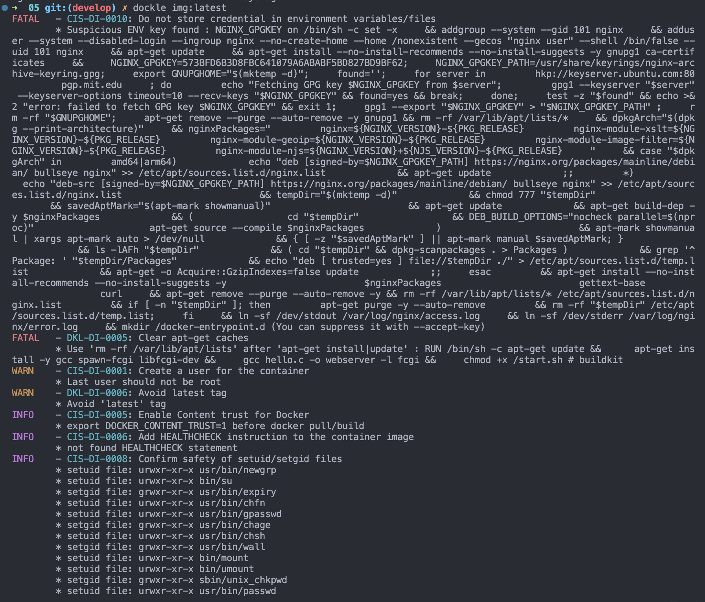
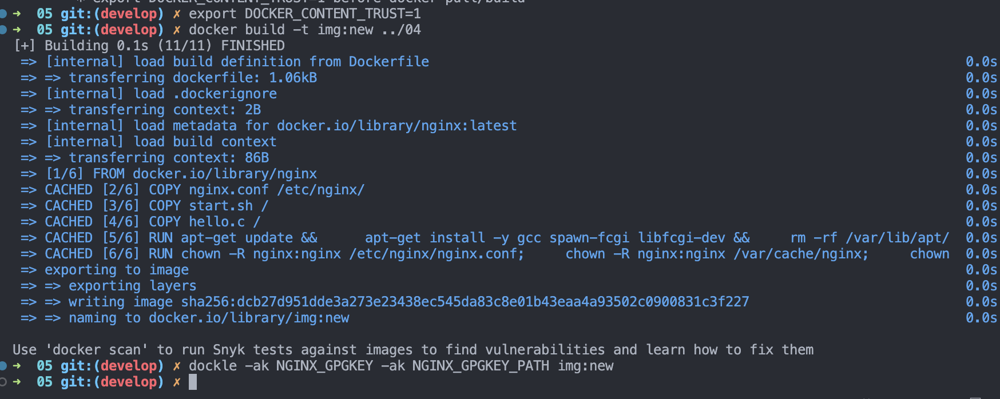

# Dockle  
***  
## 1. Скачать Dockle  
* Установка в OSX  
```  
brew install goodwithtech/r/dockle  
```
* Установка в Linux  
```  
# RHEL
$ VERSION=$(
 curl --silent "https://api.github.com/repos/goodwithtech/dockle/releases/latest" | \
 grep '"tag_name":' | \
 sed -E 's/.*"v([^"]+)".*/\1/' \
) && rpm -ivh https://github.com/goodwithtech/dockle/releases/download/v${VERSION}/dockle_${VERSION}_Linux-64bit.rpm

#Ubuntu
$ VERSION=$(
 curl --silent "https://api.github.com/repos/goodwithtech/dockle/releases/latest" | \
 grep '"tag_name":' | \
 sed -E 's/.*"v([^"]+)".*/\1/' \
) && curl -L -o dockle.deb https://github.com/goodwithtech/dockle/releases/download/v${VERSION}/dockle_${VERSION}_Linux-64bit.deb
$ sudo dpkg -i dockle.deb && rm dockle.deb  
```  
***  

## 2. Проверить образ  
```  
dockle img:new   
```  
**Вывод до правки**  

  

**Вывод после правки**  

  

```  
 export DOCKER_CONTENT_TRUST=1
 docker build -t img:new ../04 
 dockle -ak NGINX_GPGKEY -ak NGINX_GPGKEY_PATH img:new  
```  

## 3. Объяснение изменений в Dockerfile  

## Dockerfile  
***  

```  
FROM nginx
COPY nginx.conf /etc/nginx/
COPY start.sh /
COPY hello.c /

RUN apt-get update &&  \
    apt-get install -y gcc spawn-fcgi libfcgi-dev && \
    rm -rf /var/lib/apt/lists && \ 
    gcc hello.c -o hello -l fcgi && \
    chmod +x /start.sh


RUN chown -R nginx:nginx /etc/nginx/nginx.conf; \
    chown -R nginx:nginx /var/cache/nginx; \
    chown -R nginx:nginx /home; \
    touch /var/run/nginx.pid; \
    chown -R nginx:nginx /var/run/nginx.pid; \
    chmod u-s /usr/bin/gpasswd; \
    chmod u-s /usr/bin/newgrp; \
    chmod u-s /bin/su; \
    chmod u-s /bin/mount; \
    chmod u-s /bin/umount; \
    chmod u-s /usr/bin/chsh; \
    chmod u-s /usr/bin/chfn; \
    chmod u-s /usr/bin/chsh; \
    chmod 255 /usr/bin/expiry; \
    chmod 255 /usr/bin/wall; \
    chmod 255 /sbin/unix_chkpwd; \
    chmod 255 /usr/bin/chage; \
    chmod 755 /usr/bin/passwd 

USER thebest
HEALTHCHECK --interval=5m --timeout=3s CMD curl -f http://localhost/ || exit 1
ENTRYPOINT ["./start.sh"]  
```  
***  

<table>
  <thead>
    <tr>
      <th>Строка</th>
      <th>Описание</th>
      <th>Полезные ссылки</th>
      <th>Примеры использования в других ситуациях</th>
    </tr>
  </thead>
  <tbody>
    <tr>
      <td><code>RUN apt-get update &amp;&amp; apt-get install -y gcc spawn-fcgi libfcgi-dev &amp;&amp; rm -rf /var/lib/apt/lists &amp;&amp; gcc hello.c -o hello -l fcgi &amp;&amp; chmod +x /start.sh</code></td>
      <td>Обновляет пакеты, устанавливает необходимые пакеты (gcc, spawn-fcgi, libfcgi-dev), компилирует файл <code>hello.c</code> в исполняемый файл <code>hello</code> с использованием библиотеки <code>fcgi</code> и назначает права на выполнение скрипта <code>start.sh</code>.</td>
      <td><a href="https://manpages.debian.org/stretch/apt/apt-get.8.en.html" target="_new">apt-get(8)</a></td>
      <td>Другие примеры использования: Установка других пакетов с использованием <code>apt-get</code>, компиляция и установка других программ</td>
    </tr>
    <tr>
      <td><code>RUN chown -R nginx:nginx /etc/nginx/nginx.conf; chown -R nginx:nginx /var/cache/nginx; chown -R nginx:nginx /home; touch /var/run/nginx.pid; chown -R nginx:nginx /var/run/nginx.pid; chmod u-s /usr/bin/gpasswd; chmod u-s /usr/bin/newgrp; chmod u-s /bin/su; chmod u-s /bin/mount; chmod u-s /bin/umount; chmod u-s /usr/bin/chsh; chmod u-s /usr/bin/chfn; chmod u-s /usr/bin/chsh; chmod 255 /usr/bin/expiry; chmod 255 /usr/bin/wall; chmod 255 /sbin/unix_chkpwd; chmod 255 /usr/bin/chage; chmod 755 /usr/bin/passwd</code></td>
      <td>Изменяет владельца и группу для указанных файлов и директорий на <code>nginx:nginx</code>, создает пустой файл <code>nginx.pid</code> в <code>/var/run</code>, устанавливает определенные права на исполнение для указанных файлов и программ.</td>
      <td><a href="https://manpages.debian.org/buster/coreutils/chown.1.en.html" target="_new">chown(1)</a>, <a href="https://manpages.debian.org/buster/coreutils/chmod.1.en.html" target="_new">chmod(1)</a></td>
      <td>Другие примеры использования: Изменение владельца и группы для других файлов и директорий, настройка прав доступа для различных файлов и программ</td>
    </tr>
    <tr>
      <td><code>USER thebest</code></td>
         <td>Устанавливает имя пользователя, от имени которого будет выполняться дальнейшие команды в Docker-контейнере.</td>
  <td><a href="https://docs.docker.com/engine/reference/builder/#user" target="_new">Docker USER documentation</a></td>
  <td>Другие примеры использования: Установка другого имени пользователя для выполнения команд в Docker-контейнере</td>
</tr>
<tr>
  <td><code>HEALTHCHECK --interval=5m --timeout=3s CMD curl -f <a href="http://localhost/" target="_new">http://localhost/</a></code></td>
  <td>Эта строка определяет команду проверки состояния контейнера для мониторинга его здоровья. Команда curl выполняет HTTP-запрос на локальный хост по адресу http://localhost/ с использованием опции -f, которая заставляет curl завершиться с ошибкой, если HTTP-запрос возвращает код ошибки. Если команда curl завершается с ошибкой (код выхода не равен 0), то выполнение CMD будет прервано с кодом выхода 1, что будет считаться контейнером нездоровым. Эта проверка будет выполняться каждые 5 минут (--interval=5m) с таймаутом 3 секунды (--timeout=3s).</td>
  <td></td>
  <td></td>
</tr>
</tbody>
</table>  

***  
