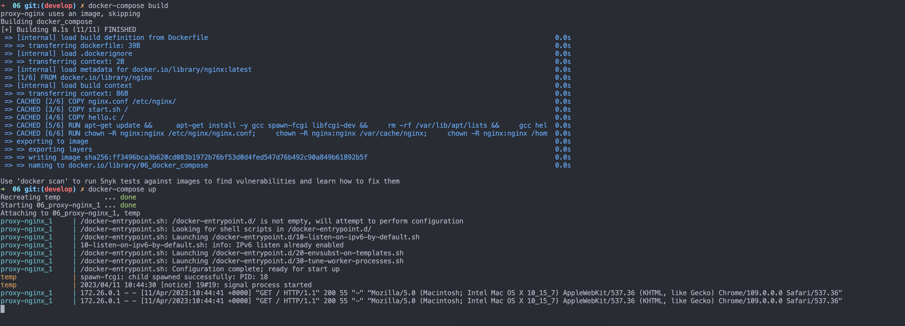

# Docker-compose  
***  

## Собираем проект при помощи Docker-compose  
1. Пишем `docker-compose.yml` файл  
```  
version: '3'

services:
    docker_compose:
        build: ../04/
        container_name: temp
        volumes:
            - ../04/nginx.conf:/etc/nginx/nginx.conf
    proxy-nginx:
        image: nginx
        # container_name: proxy
        ports:
            - 80:8080
        volumes:
            - ./nginx.conf:/etc/nginx/nginx.conf
            # - /var/log/nginx:/var/log/nginx  
```  

## Пояснение Dockerfile-compose
<table>
<thead>
<tr>
<th>Строка</th>
<th>Пояснение</th>
<th>Полезные ссылки</th>
<th>Примеры</th>
</tr></thead>
<tbody>
<tr>

<td>version: '3'</td>

<td>Указывает версию синтаксиса файла Docker Compose. В данном случае используется версия 3.</td>

<td><a href="https://docs.docker.com/compose/compose-file/" target="_new">Справочник по файлам Docker Compose</a></td>

<td>version: '2', version: '2.1', version: '3.8'</td></tr>
<tr>

<td>services: docker_compose:</td>

<td>Определяет сервис с именем "docker_compose", который будет создан с использованием файла Docker Compose.</td>
<td><a href="https://docs.docker.com/compose/compose-file/compose-file-v3/#services" target="_new">Справочник по файлам Docker Compose - services</a></td>
<td>services: nginx, services: db, services: web</td></tr><tr>
<td>build: ../04/</td>
<td>Указывает контекст сборки для сервиса "docker_compose", который представляет собой каталог "../04/" относительно расположения файла Docker Compose. Образ Docker для сервиса будет собран на основе файлов в этом каталоге.</td>
<td><a href="https://docs.docker.com/compose/compose-file/compose-file-v3/#build" target="_new">Справочник по файлам Docker Compose - build</a></td>
<td>build: ., build: ./app, build: ./web/</td></tr><tr>
<td>container_name: temp</td>
<td>Задает имя контейнера "temp". Это предоставляет уникальное имя для контейнера, что может быть полезно для управления и идентификации контейнеров в окружении Docker Compose.</td>
<td><a href="https://docs.docker.com/compose/compose-file/compose-file-v3/#container_name" target="_new">Справочник по файлам Docker Compose - container_name</a></td>
<td>container_name: nginx, container_name: db</td></tr><tr>
<td>volumes:</td>
<td>Определяет тома, которые будут примонтированы в контейнере. Тома предоставляют способ сохранения данных между перезапусками контейнеров или обмена данными между контейнерами. В данном случае, файл "../04/nginx.conf" на хосте монтируется в "/etc/nginx/nginx.conf" в контейнере.</td>
<td><a href="https://docs.docker.com/compose/compose-file/compose-file-v3/#volumes" target="_new">Справочник по файлам Docker Compose - volumes</a></td>
<td>volumes: ./data:/app/data, volumes: /var/db:/data/db</td></tr><tr>
<td>proxy-nginx:</td>
<td>Определяет сервис с именем "proxy-nginx", который будет использовать Docker-образ "nginx".</td>
<td><a href="https://docs.docker.com/compose/compose-file/compose-file-v3/#services" target="_new">Справочник по файлам Docker Compose - services</a></td>
<td>proxy-nginx: mysql, proxy-nginx: webserver</td></tr><tr>
<td>image: nginx</td>
<td>Указывает Docker-образ, который будет использоваться для сервиса "proxy-nginx", в данном случае, образ "nginx" из Docker Hub.</td>
<td>[Справочник по файлам Docker Compose - image](<a href="https://docs.docker.com/compose/compose-file/compose-file-v3" target="_new">https://docs.docker.com/compose/compose-file/compose-file-v3</a></td>
<td></td></tr></<tbody><tr>
<td>ports:</td>
<td>Определяет порты, которые будут открыты на хосте и проброшены в контейнер. В данном случае, порт 80 на хосте будет проброшен на порт 8080 контейнера "proxy-nginx".</td>
<td><a href="https://docs.docker.com/compose/compose-file/compose-file-v3/#ports" target="_new">Справочник по файлам Docker Compose - ports</a></td>
<td>ports: 8080:80, ports: 3306:3306</td></tr><tr>
<td>volumes:</td>
<td>Определяет тома, которые будут примонтированы в контейнере. В данном случае, файл "./nginx.conf" на хосте монтируется в "/etc/nginx/nginx.conf" в контейнере "proxy-nginx".</td>
<td><a href="https://docs.docker.com/compose/compose-file/compose-file-v3/#volumes" target="_new">Справочник по файлам Docker Compose - volumes</a></td>
<td>volumes: ./config:/app/config, volumes: /var/log/nginx:/var/log/nginx</td></tr><tr>
<td>Комментарий (# container_name: proxy)</td>
<td>Эта строка содержит комментарий, который начинается с символа "#" и предназначен для описания или пояснения определенных настроек в файле Docker Compose. В данном случае, контейнер "proxy" закомментирован, и не будет создан при запуске Docker Compose.</td>
<td><a href="https://docs.docker.com/compose/compose-file/compose-file-v3/#comments" target="_new">Справочник по файлам Docker Compose - комментарии</a></td>
<td># container_name: web, # container_name: db</td></tr><tr>
<td>Примеры</td>
<td></td>
<td></td>
<td></td></tr><tr>
<td>image: mysql</td>
<td>Замена образа "nginx" на образ "mysql" для сервиса "proxy-nginx", чтобы создать контейнер с MySQL сервером.</td>
<td></td>
<td>image: postgres, image: redis</td></tr><tr>
<td>ports: 8081:80</td>
<td>Изменение порта на хосте с 80 на 8081, чтобы пробросить на порт 80 контейнера "proxy-nginx".</td>
<td></td>
<td>ports: 8000:80, ports: 8888:8080</td></tr><tr>
<td>volumes: ./config:/etc/nginx/conf.d</td>
<td>Примонтирование каталога "./config" на хосте в "/etc/nginx/conf.d" контейнера "proxy-nginx" для кастомных настроек Nginx.</td>
<td></td>
<td>volumes: /data:/var/data, volumes: /logs:/var/logs</td>
</tr>
</tbody>
</table>

***
## 2. Поправить nginx.conf (Объяснение правок)  
```  
worker_processes  1;

events {
    worker_connections  1024;
}


http {
    include       mime.types;
    default_type  application/octet-stream;

    sendfile        on;

    keepalive_timeout  65;

    server {
        listen       8080;
        server_name  localhost;

        location = / {
            proxy_pass http://temp:81;
        }

        location = /status {
            stub_status;
        }
    }
}  
```  
***  

```  
listen       8080;
 location = / {
            proxy_pass http://temp:81;
        }  
```


Описание nginx-сервера, содержащегося в файле конфигурации, включает несколько директив, таких как "location", "listen" и "server_name", которые работают взаимосвязанно для настройки сервера.

1. "location = /" - Эта директива определяет местоположение (URL-путь), на который будет откликаться nginx-сервер. В данном случае, это точное совпадение с URL-путем "/", то есть главная страница сайта.

2. "proxy_pass <a href="http://temp:81" target="_new">http://temp:81</a>;" - Эта директива определяет, куда будет перенаправлен запрос, полученный на местоположение "/", на другой сервер. В данном случае, запрос будет перенаправлен на сервер с именем "temp" и портом 81 по протоколу HTTP.

3. "listen 8080;" - Эта директива определяет порт, на котором nginx-сервер будет слушать входящие соединения. В данном случае, это порт 8080.

4. "server_name localhost;" - Эта директива определяет имя сервера, на которое будет откликаться nginx-сервер. В данном случае, это имя "localhost", что означает, что сервер будет откликаться только на запросы, отправленные на локальный хост.


Взаимосвязь между этими директивами состоит в следующем: nginx-сервер слушает входящие соединения на порту 8080 и отвечает только на запросы, отправленные на локальный хост с URL-путем "/" (главная страница сайта). Когда такой запрос получен, он перенаправляется на сервер с именем "temp" и портом 81 по протоколу HTTP с использованием директивы "proxy_pass". Таким образом, все запросы на главную страницу сайта, полученные на порту 8080, будут перенаправлены на сервер "temp" на порт 81 для дальнейшей обработки.
А `temp` это наш контейнер где билдится наш `hello.c` файл. 

***  

##  Фоточки  


